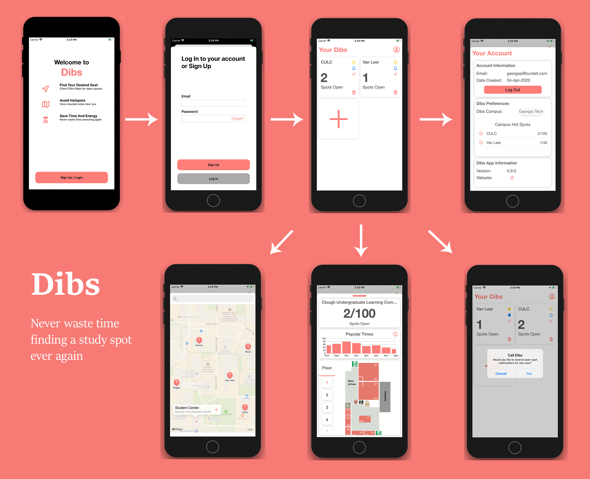

## Project Overview

Dibs is a full stack solution for helping students find open study spaces on campus. Light detection sensors send data that updates an iOS application to deliver clear visuals to open spots near them.
Dibs is a Spring 2020 ECE Senior Design project.

## Authors

- Jacob Lattie (iOS)
- Peter Nguyen (Server)
- Dylan Verstandig (BLE)
- Stephen Via (HW Sensor)
- Raish Wadhwaniya (HW Sensor)
- Dr. Lukas Graber (Advisor)

## Gallery


[Demonstration Video](https://www.youtube.com/watch?v=HJM3BfB4vtE)

## Hardware and Software

### Hardware

```
Raspberry Pi 3
nRF52840 Breakout
TLV2462 Op Amp
GL5528 LDR
```

### Software

```
Xcode 11.3.1
iOS 13+
Firebase Console
Adobe XD, Photoshop
```
